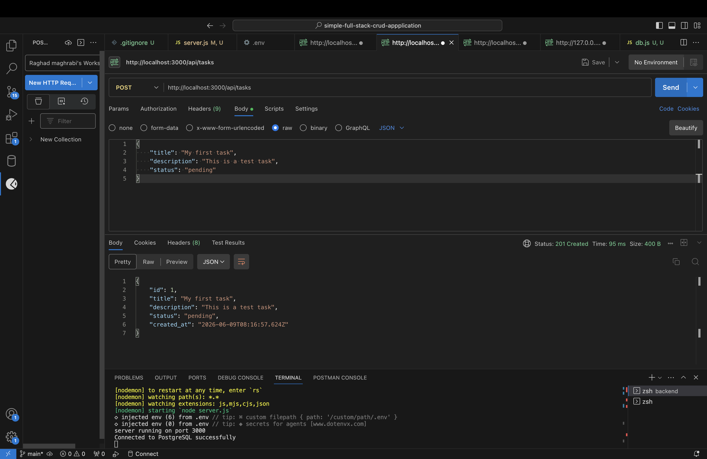
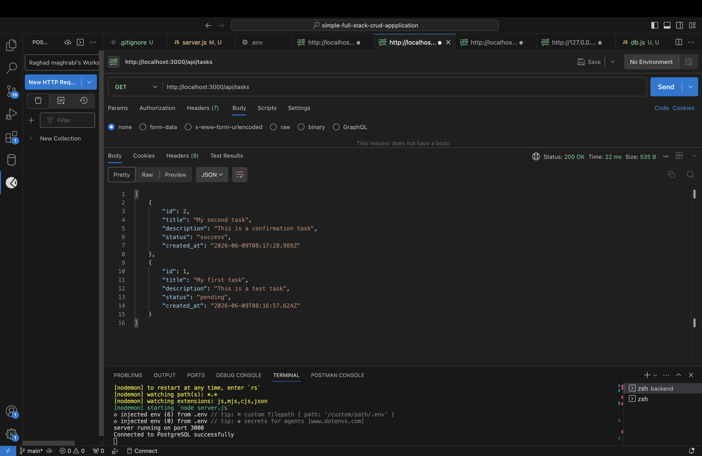
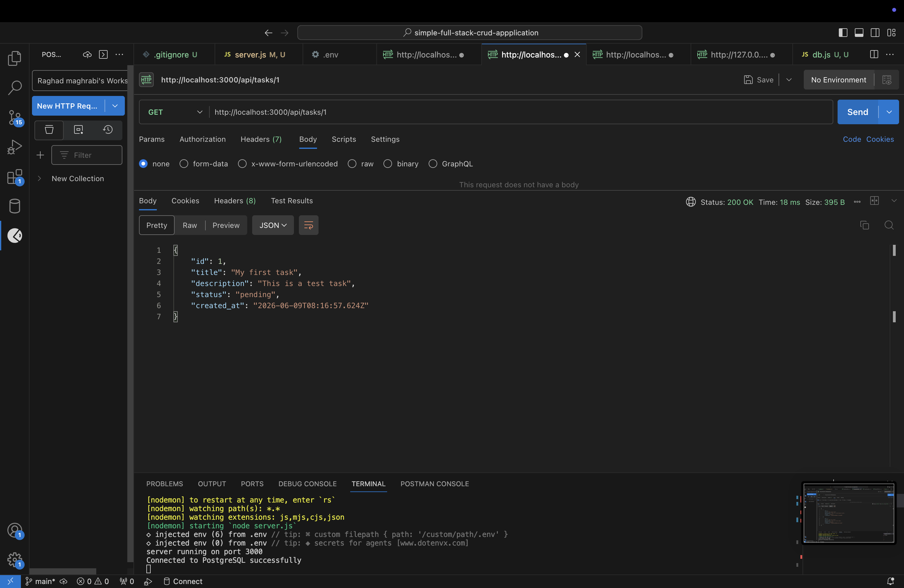
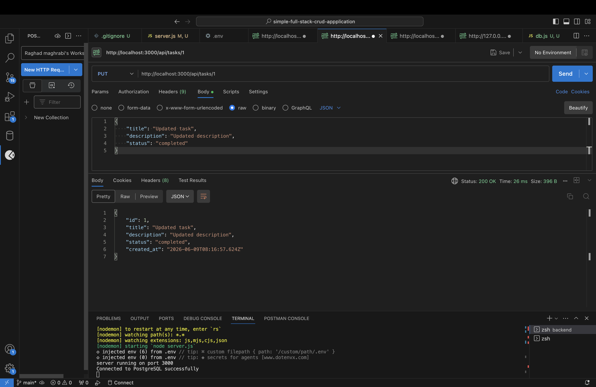
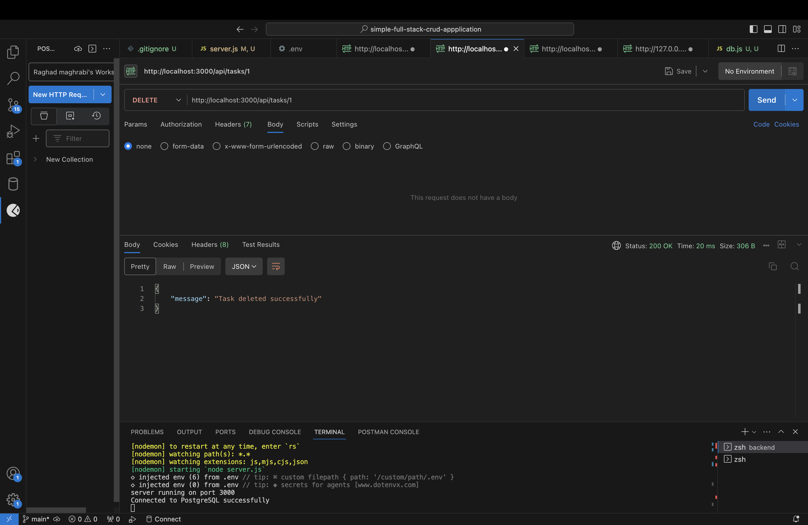

# Task Manager Application

## Setup Instructions
1. Clone the repo
2. cd backend
3. npm install
4. Add .env file with your database credentials
5. npm run dev

## API Endpoints
| Method | Endpoint | Description |
|--------|----------|-------------|
| GET | /api/tasks | Get all tasks |
| GET | /api/tasks/:id | Get single task |
| POST | /api/tasks | Create task |
| PUT | /api/tasks/:id | Update task |
| DELETE | /api/tasks/:id | Delete task |

## Database Schema
```sql
CREATE TABLE tasks (
    id SERIAL PRIMARY KEY,
    title VARCHAR(255) NOT NULL,
    description TEXT,
    status VARCHAR(50) DEFAULT 'pending',
    created_at TIMESTAMP DEFAULT CURRENT_TIMESTAMP
);
```

## Screenshots

### Create Task


### Get All Tasks


### Get Single Task


### Update Task


### Delete Task

